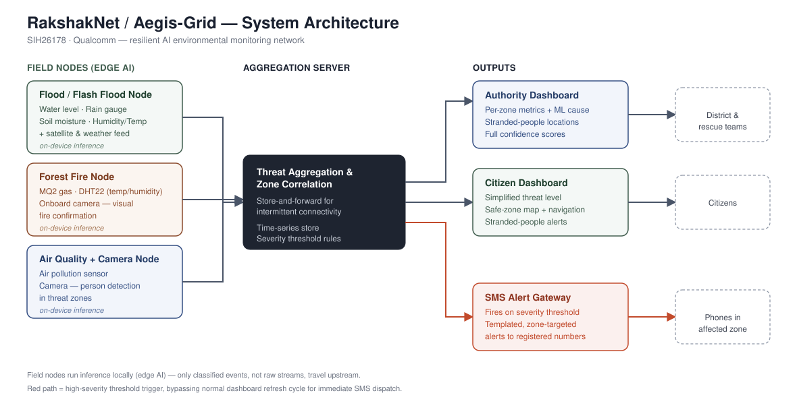

# RakshakNet / Aegis-Grid

Software solution for **SIH26178 (Qualcomm)** — a resilient, AI-powered environmental monitoring network for early detection, localized intelligence, and actionable alerts for floods, forest fires, pollution events, and other environmental hazards.

## Architecture

Field nodes run inference locally (edge AI) and only forward classified threat events upstream. The aggregation server correlates zone-level signals and drives two dashboards (Authority, Citizen) plus an SMS alert gateway that fires automatically once a zone crosses a severity threshold.

## Dashboard prototype

`index.html` / `style.css` / `app.js` / `data.js` are a frontend-only demo of the dashboard, using mock zone data in place of live sensor feeds:

- **Authority view** — per-zone sensor readings, ML-predicted cause with confidence, camera-based stranded-people detection, manual SMS dispatch.
- **Citizen view** — simplified threat level, safe-zone guidance, one-tap navigation to the nearest safe area, and the same stranded-people alert (framed for community assistance).
- **SMS log** — simulates dispatch whenever a zone is escalated (use the "Simulate escalation" button for a live demo).

Open `index.html` directly in a browser — no build step required.

### Not yet wired up
- Real sensor/edge ingestion (currently mock data in `data.js`)
- Actual SMS gateway integration (Twilio or a local telecom API)
- Backend aggregation server / time-series store